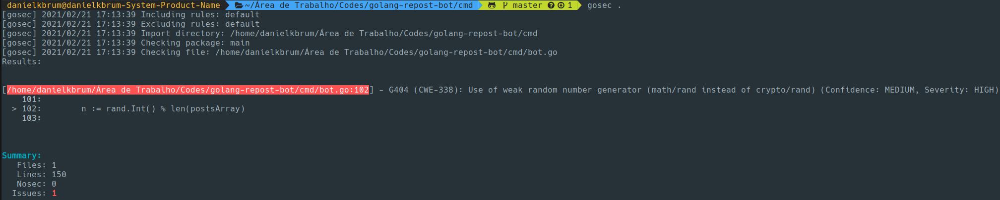

# Tutorial GoSec

Esse tutorial tem como objetivo demonstrar o uso da ferramenta Go Sec.

## O que é?

Go Sec é uma ferramenta que inspeciona o código e busca por falhas de segurança. O GoSec faz isso atraveś de uma análise
da AST (Abstract Syntax Tree) do Go.

## Passo a passo

O tutorial irá demonstrar a instalação local e o uso do Go Sec.

- Passo 1:
    Instalar o pacote do Go Sec
    ```
    go get github.com/securego/gosec/cmd/gosec
    ```

- Passo 2:
    Agora o Go Sec está disponível e já é possível realizar verificações

    Por padrão, todas as regras do Go Sec estarão habilitadas, para mais detalhes sobre as regras disponíveis, checar a documentação:

    [Uso do Go Sec](https://github.com/securego/gosec#usage)

- Passo 3:
    Para rodar o Go Sec em todos os arquivos presentes em um diretório, basta rodar o seguinte comando:

    ```
    gosec .
    ```

    Após esse comando, o Go Sec irá gerar um relatório apontando se há falhas ou não, e também irá exibir qual é a regra que foi aplicada para a detecção da(s) falha(s), caso houver.

Segue um exemplo de um relatório após rodar o Go Sec:



Nesse caso, o Go Sec encontrou uma vulnerabilidade de segurança no código.

É possível ver na imagem a regra violada (G404), a descrição da regra, o nível de confiança do Go Sec e o nível de severidade da vulnerabilidade.

Além disso, o Go Sec também sugere uma alteração para corrigir a vulnerabilidade.

Como foi demonstrado, o Go Sec pode ser um bom aliado para analisar o código e buscar vulnerabilidades de segurança em projetos escritos em Go.


    